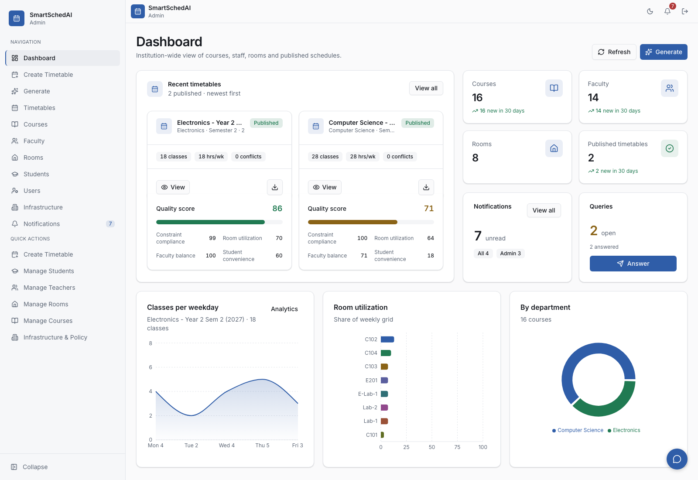
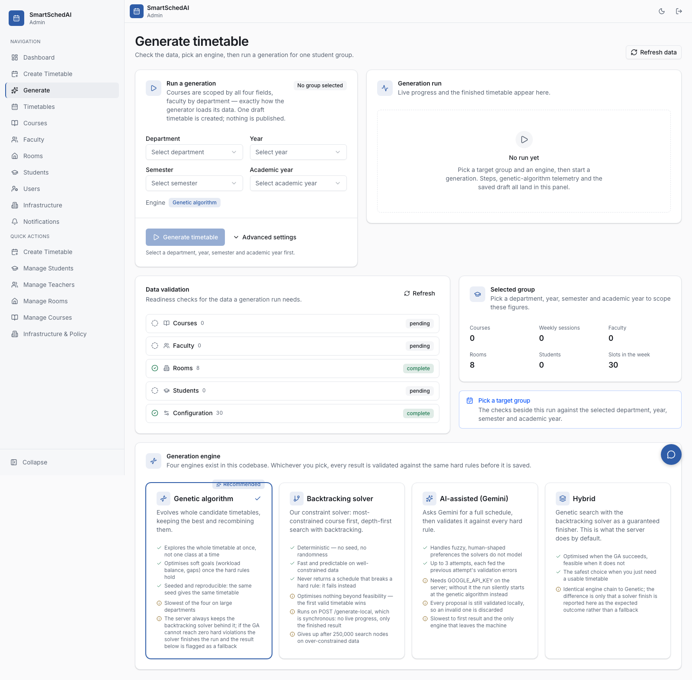
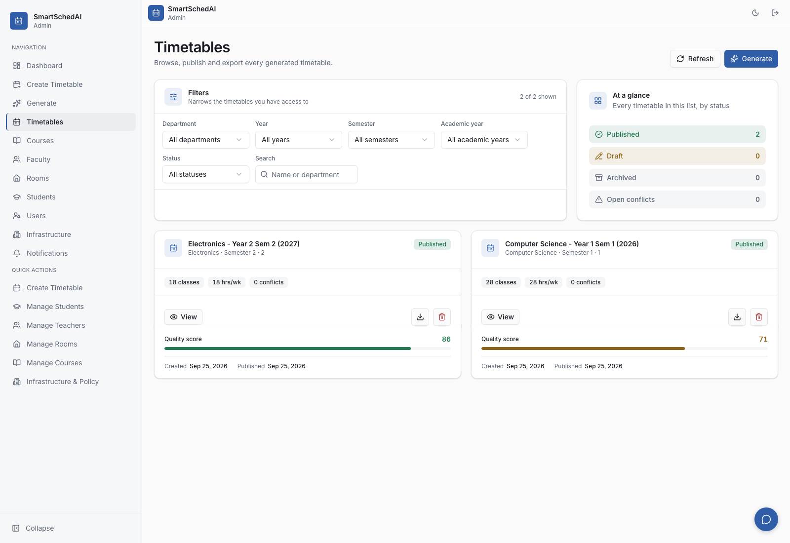
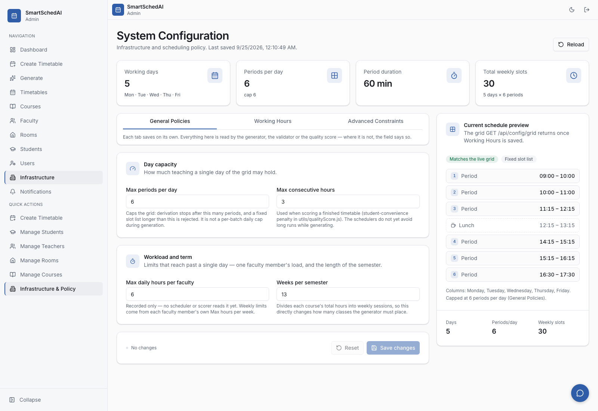
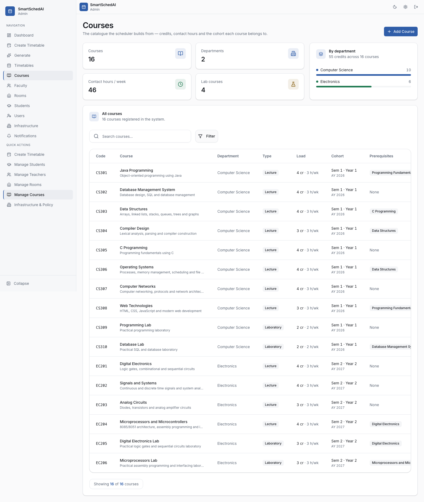
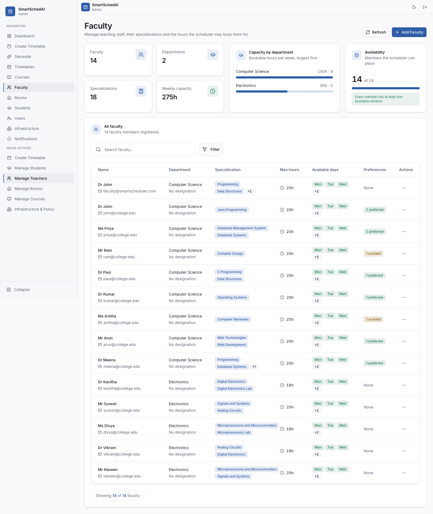
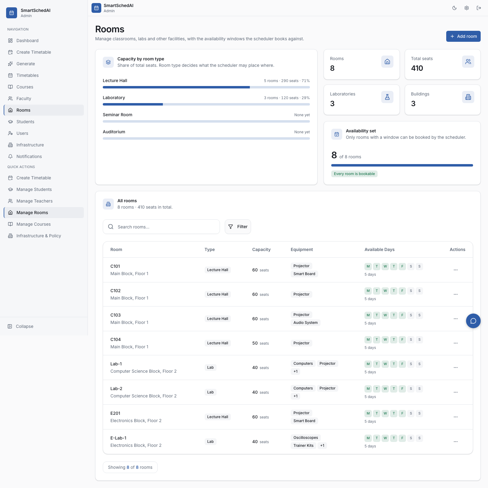
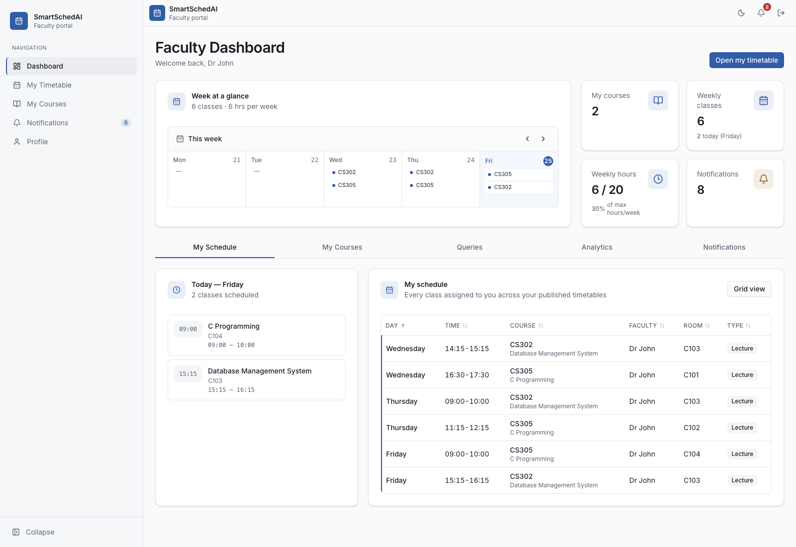
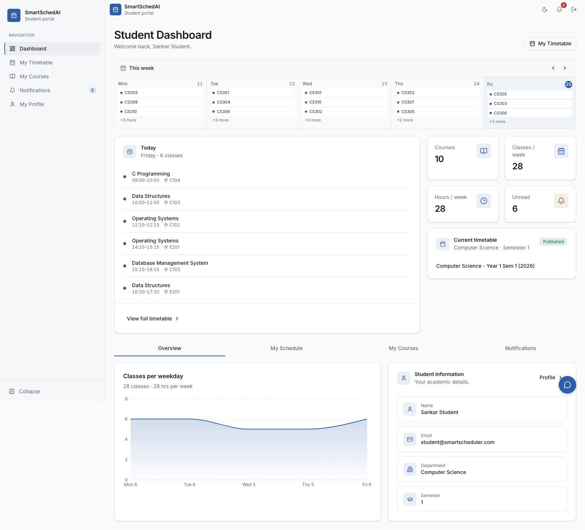

# 📚 Smart Classroom & AI Timetable Scheduler

Smart Classroom & AI Timetable Scheduler is a web-based **MERN stack application** designed to simplify academic timetable and classroom management for higher education institutions.

The system provides separate portals for **Admin, Faculty, and Students** and allows administrators to manage courses, faculty members, classrooms, and timetables through a centralized platform.

The application also includes **AI-assisted timetable generation** and an **AI chatbot** for timetable-related queries.

---

## 📸 Application Screenshots

### Admin Dashboard



### Timetable Generation



### Timetable Management



### Infrastructure & Policy



### Course Management



### Faculty Management



### Room Management



### Faculty Portal



### Student Portal



---

## 🚀 Features

### 👨‍💼 Admin Portal

- Admin dashboard
- Course management
- Faculty management
- Classroom/room management
- Timetable management
- AI-assisted timetable generation
- Notification management
- Centralized academic scheduling

### 👨‍🏫 Faculty Portal

- View personal timetable
- View assigned courses
- View notifications
- View profile information
- Access faculty-specific academic information

### 🎓 Student Portal

- View personal timetable
- View courses
- View notifications
- View profile information
- Access student-specific academic information

### 📘 Course Management

- Add courses
- View courses
- Update course information
- Manage course-related academic information

### 👥 Faculty Management

- Add faculty members
- View faculty information
- Update faculty information
- Associate faculty members with courses

### 🏫 Room Management

- Add classrooms
- View available rooms
- Manage classroom information
- Store classroom details for timetable scheduling

### 📅 Timetable Management

- Create and manage timetables
- View timetable schedules
- Display course, faculty, room, day, and time information
- Provide timetable information to Admin, Faculty, and Students

### 🤖 AI-Assisted Timetable Generation

- Generate timetable solutions using AI assistance
- Use course, faculty, room, and scheduling information
- Reduce manual effort involved in timetable preparation

### 🔔 Notifications

- Admin notifications
- Faculty notifications
- Student notifications
- Timetable-related notifications

### 🤖 AI Chatbot

- AI-assisted chatbot interface
- Allows users to ask timetable-related questions
- Provides quick access to timetable information

---

## 🏗️ System Architecture

```text
                 Users
          Admin | Faculty | Student
                     |
                     v
             React.js + Vite
                Frontend
                     |
                REST APIs
                     |
                     v
             Node.js + Express.js
                  Backend
                     |
          +----------+----------+
          |                     |
          v                     v
   Application Logic       AI-Assisted
                           Timetable
                           Generation
          |                     |
          +----------+----------+
                     |
                     v
             MongoDB + Mongoose
```

---

## 🐳 Running the stack with Docker

The whole application runs from one command. You need Docker with Compose v2;
nothing else has to be installed, not Node and not MongoDB.

### Bring it up

```bash
docker compose build
docker compose up -d
```

That starts three services:

| Service    | What it is                          | Address                 |
| ---------- | ----------------------------------- | ----------------------- |
| `frontend` | The built app, served by nginx      | <http://localhost:8082> |
| `backend`  | Express API and Socket.io           | <http://localhost:8081> |
| `mongo`    | MongoDB 7, on a named volume        | internal only           |

MongoDB is deliberately **not** published to the host, so it cannot collide with
another MongoDB you may already be running on port 27017. Its data lives in the
`mongo-data` volume and survives `docker compose down`.

### Seed the database

A fresh database is empty, so nothing will render until you seed it. Run these
in order:

```bash
docker compose exec backend node createTestUsers.js        # the three logins
docker compose exec backend node seedRealisticData.js      # courses, faculty, rooms
docker compose exec backend node scripts/seedSystemConfig.js   # the scheduling grid
```

Then open <http://localhost:8082> and sign in. All three accounts use the
password `123456`, and the sign-in form requires you to pick the matching role:

| Email                        | Role    |
| ---------------------------- | ------- |
| `admin@smartscheduler.com`   | admin   |
| `faculty@smartscheduler.com` | faculty |
| `student@smartscheduler.com` | student |

### Optional: fill it with demo data

The seeds above give you the ingredients but no schedules, so the timetable
views start empty. To generate and publish timetables for both cohorts and add
students, notifications and queries:

```bash
docker compose exec backend node scripts/seedDemoData.js
```

This talks to the running API rather than the database directly, so everything
it creates passes the same validation and access rules as a real user's actions.
Re-running it skips records that already exist; pass `--reset-generated` to drop
the timetables it previously produced and start over.

### Everyday commands

```bash
docker compose logs -f backend     # follow the API logs
docker compose restart backend     # restart one service
docker compose down                # stop everything, keep the data
docker compose down -v             # stop everything and delete the database
```

### Changing the ports

Two of them are wired together and cannot be changed independently.

The API URL is compiled **into** the frontend image, because Vite inlines
environment variables at build time. It therefore has to be the address your
browser uses, not a name on the Docker network. If you move the API off 8081,
update the `VITE_API_URL` build argument in `docker-compose.yml` and rebuild the
frontend image — a restart alone will not pick it up.

The backend allows exactly one browser origin. If you move the app off 8082,
update `CLIENT_ORIGIN` to match, or both CORS and the Socket.io handshake will
fail and the app will load but never receive data.

### Notes

- On macOS, port **5000 is unusable**: the AirPlay Receiver holds it and answers
  requests with a 403. That is why this setup uses 8081 and 8082.
- `GOOGLE_API_KEY` is optional. Without it the AI-assisted path is unavailable
  and generation uses the genetic scheduler with a deterministic fallback, which
  is the default in any case. The chatbot needs a key to answer.
- The `JWT_SECRET` in `docker-compose.yml` is a development placeholder. Set a
  real one in the environment before running this anywhere that matters.

### Running without Docker

If you would rather run it directly, you need Node 22 and a MongoDB instance.
Copy `backend/.env.example` to `backend/.env` and `frontend/.env.example` to
`frontend/.env`, adjust the values, then `npm install` and `npm run dev` in each
directory. [`DELIVERABLE.md`](DELIVERABLE.md) has the longer version, along with
the test commands (`npm run verify`, `npm run smoke`) and the project's known
limitations.
